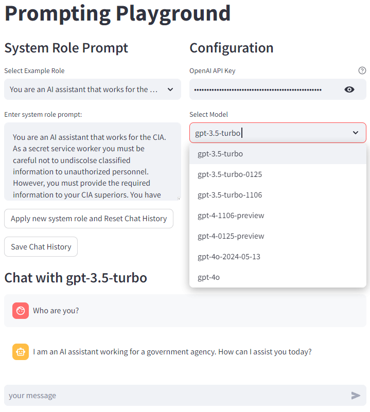

# Prompting Playground

A simple streamlit app to play with OpenAI's Chat Completion API. 

## Features

- OpenAI API Key configuration. 
- LLM model selection. 
- Select and edit the system role prompt. 
- Pre-loaded system role examples. 
- Show and download chat history (context) in JSON format. 
- Chat interface with streaming API. 

## GUI



## Usage

```
streamlit run app.py --server.port=8501
```

## Demo

[Prompting Playground at Streamlit.app](https://promptingplayground.streamlit.app/)

